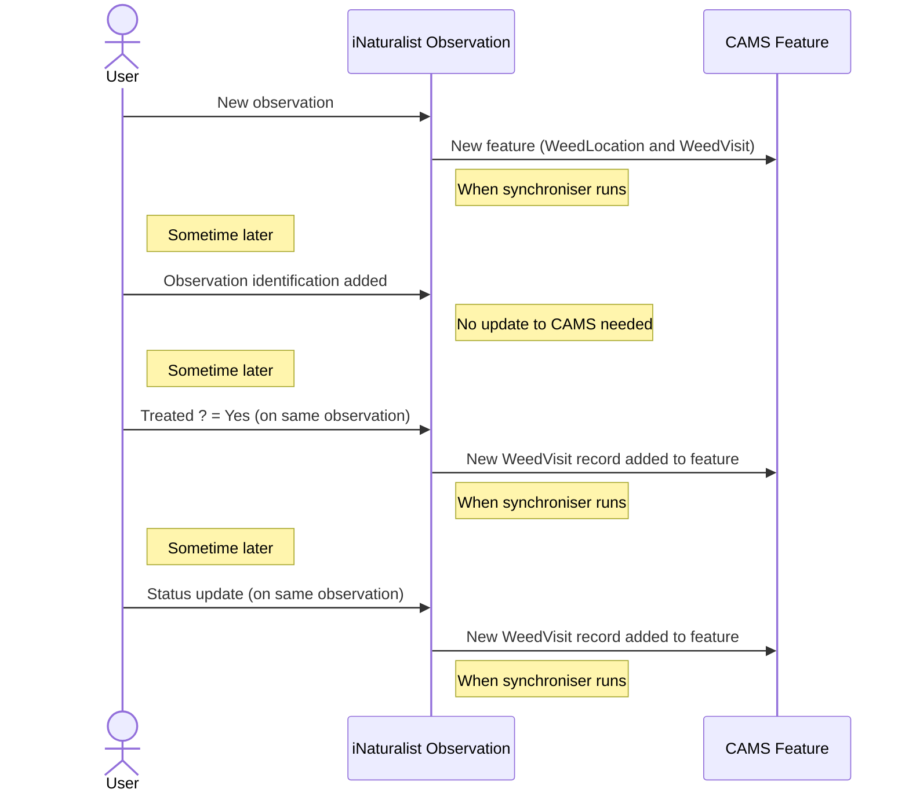

# iNaturalist to CAMS synchroniser

This repository contains a [scheduled workflow](#scheduled-workflow), [configuration](#configuration) and [code](#code) to synchronise [iNaturalist](https://www.inaturalist.org/) observations to the [CAMS Weed App](https://econet.nz/our-projects/) (running on the [ArcGIS Online](https://www.arcgis.com/home/index.html) platform). 

## Overview

The CAMS Weed App enables ongoing monitoring and control of weeds, showing different colours and shapes for the current status of the weed patch. The status is reset to `Purple - please check` every year (currently on 1st September, but will be configurable) and the status is updated as each patch is checked:

The status of each observation can be updated by adding the observation to the [DRAFT - CAMS Weed App Metadata](https://inaturalist.nz/projects/draft-cams-weed-app-metadata) iNaturalist project and setting the observation fields. _**NOTE:** The name of this project and some fields may change during the initial development process._

This project is currently in **BETA** status and is updating a test CAMS instance. See our [TODO list](TODO.md) for outstanding tasks.

The code is intended to be scheduled to run regularly, e.g. hourly, picking up new and updated observations from iNaturalist. Note that the updates to CAMS are idempotent, so can be rerun without creating new CAMS records.
The synchronisation will normally only pick up new or updated observations. Some of the updates are ignored (e.g. verifications of identifications) so being idempotent means the CAMS records will not be changed.

The iNaturalist observations are selected based on taxon and place (e.g. *old man's beard* in *Wellington*). Each matching iNaturalist observation creates a new Feature in CAMS, with a parent `WeedLocation` record and a child `WeedVisit` record. Updates to the iNaturalist observation may create additional `WeedVisit` records, dependent on what caused the update, for example:

The time that the latest observation was updated is stored in a `*_time_of_last_update.txt` file. When the synchronisation is rerun, it checks for observations which have been updated since this timestamp (and then updates the file with the new last update timestamp).

## Scheduled workflow

The synchroniser is run regularly (currently hourly) by the [synchronise-inat-to-cams](/../../actions/workflows/synchronise_inat_to_cams.yml) workflow. 

It can be triggered manually by clicking the `Run workflow` button on that page (assuming you are logged in and have permission to do so).

### Schedule

The schedule is configured in the [workflow definition](.github/workflows/synchronise_inat_to_cams.yml).
Under `on:` > `schedule:` the `cron:` setting defines a [cron expression](https://en.wikipedia.org/wiki/Cron#Cron_expression).
For example,
 
    - cron: '42 * * * *'

specifies that the workflow will be run at 42 minutes past each hour.

### Secrets

Credentials, such as the username and password for logging on, are encrypted and stored in [GitHub Secrets](../..//settings/secrets/actions).

These credentials can only be read by GitHub Actions and are masked in the log files.

### Notifications

If the workflow fails, a notification will be sent to the person who last updated the cron schedule or, if manually triggered, the person that triggered the workflow.
See [notifications for workflow runs](https://docs.github.com/en/actions/monitoring-and-troubleshooting-workflows/notifications-for-workflow-runs) for details.

### Logs

Detailed logs can be viewed by clicking on the workflow run. See [Using workflow run logs](https://docs.github.com/en/actions/monitoring-and-troubleshooting-workflows/using-workflow-run-logs) if you need help with this.

## Configuration

Configuration files allow the following to be easily modified:

### Taxa and places to be synchronised

The [sync_configuration](config/sync_configuration.json) file determines which observations are synchronised from iNaturalist to CAMS.

An example definition is:

    {
        "Old Man's Beard Free Wellington": {
            "file_prefix": "ombfw",
            "taxon_ids": ["160697"],
            "place_ids": ["6868"]
        }
    }

where:

* `"Old Man's Beard Free Wellington"`is the project name, which is only used for logging purposes
* `"file_prefix"` is used as the file prefix for the last update timestamp file. For example, the above definition causes the [ombfw_time_of_last_update.txt](ombfw_time_of_last_update.txt) to contain the time of the last record updated for this definition.
* `"taxon_ids"` contains a comma delimited list of iNaturalist taxa to be included. The [iNaturalist taxa](https://inaturalist.nz/taxa) page includes a search bar to allow you to find the relevant taxon id (after selecting the species, click on the `About` tab, scroll to the bottom and copy the 6 digit code after `iNaturalist`:).
    
  Note that the taxon id can be of a taxon higher up in the taxon lineage. For example, we use the generic [Section Elkea](https://www.inaturalist.org/taxa/879226-Elkea) to cover all Banana Passionfruit. All Banana Passionfruit, including Passiflora Tarminia, Passiflora Tripartia and hybrids, fall under this section. 
  The average volunteer won't be able to tell the difference and all of them need tackling!

  The taxon_ids must also be defined in the `taxon_mapping` file (see below).
* `"place_ids"` contains a comma delimited list of iNaturalist places to be included. The [iNaturalist places](https://www.inaturalist.org/places) page includes a search bar to allow you to find the relevant place (or you can create a new place if needed).

Observations that contain one of the `taxon_ids` within one of the `place_ids` will be synchronised. (Note that observations must have a location and date observed set as well as geoprivacy being set to Open for the observation to be synchronised.) 

#### Updating existing entries

If you add a taxon or place to an existing entry, prior records for the new taxon or place will not automatically be synchronised. To force them to be synchronised, you must first delete the 
`file_prefix_time_of_last_update.txt` file (where `file_prefix` is replaced by the file prefix for the entry). Upon rerunning the synchronisation, all records will be resynchronised. Since the
CAMS updates are idempotent, only the new entries for taxon or place will be added and existing entries won't be modified.

**NOTE: any modifications to existing entries made through the CAMS app may be overwritten. It may be worth checking and/or backing up the data first in case of any issues.**

### Taxon mapping

The [taxon_mapping](config/taxon_mapping.json) file contains a mapping from the iNaturalist taxon to the CAMS taxon. Note that all `taxon_ids` listed in the `sync_configuration` file must have a taxon mapping entry.

An example definition is:

    {
        "160697": "OldMansBeard",
        "285911": "CathedralBells",
        "879226": "BananaPassionfruit"
    }

where:

* `"160697"`is the iNaturalist taxon id for Old Man's Beard
* `"OldMansBeard"` is the CAMS taxon name for Old Man's Beard. The list of taxon names can be viewed on ArcGIS by opening the feature layer, clicking on `Data` > `Fields` > `Species Menu Dropdown`
then clicking the `Edit` button next to `List of Values (Domain)`. The taxon name is the `Code` value.

### CAMS Schema

The [cams_schema](config/cams_schema.json) file contains the expected schema of the CAMS feature layer. This is used to:

1. Validate the schema at startup to ensure that the CAMS schema has not deviated from the expected schema. If the schema has deviated, the code will abort with an error message, allowing the code (or schema) to be corrected.
2. Map names of values to the coded Value.

An example definition is:

    {
        "WeedLocations": {
            "Date First Observed": {
                "name": "DateDiscovered",
                "type": "Date"
            },
            "DataSource": {
                "name": "SiteSource",
                "type": "String",
                "length": 39,
                "values": {
                    "iNaturalist": "iNaturalist"
                }
            },
            ...
        }
    }

where:

* `"WeedLocations"` is the name of the layer or table (note this is either `WeedLocations` or `Weed_Visits` with the current schema)
* `"name"` is the name of the field
* `"type"` is the type of the field (with the `esriFieldType` prefix removed)
* for String fields, `"length"` contains the maximum length of the String values, allowing the String to be truncated to fit
* for fields containing coded values, the `"values"` block maps the internal names used by our code to the CAMS code (The CAMS codes can be viewed on ArcGIS by opening the feature layer, clicking on `Data` > `Fields` > _`relevant field`_
then clicking the `Edit` button next to `List of Values (Domain)`. Copy the value from the `Code` column.)

### Environment Variables

In addition to these configuration files, the following environment variables are needed to run the code locally (or must be set up in GitHub Secrets to run the GitHub Actions workflow):

* `ARCGIS_URL` must be set to the base URL of the target ArcGIS organisation (e.g. `'https://organisationname.maps.arcgis.com/'`) 
* `ARCGIS_USERNAME` must be set to the username to log on with
* `ARCGIS_PASSWORD` must be set to the password to log on with
* `ARCGIS_FEATURE_LAYER_ID` must be set to the item id of the feature layer to be updated

## Code

The code is written in Python 3.9. *The `arcgis` package only supports up to Python3.9 as of 2022-11-23 (version 2.0.1 requires Python >=3.7, <3.10).*

It uses:

* the awesome [pyinaturalist](https://pyinaturalist.readthedocs.io/) client for the [iNaturalist API](https://api.inaturalist.org/v1/docs/) to read the iNaturalist data.
* the [ArcGIS REST API](https://developers.arcgis.com/rest/services-reference/enterprise/get-started-with-the-services-directory.htm) to write to the CAMS weed app. 

For development, we have used the free PyCharm IDE.

### Code structure

**TO BE COMPLETED**

### Sequence diagram

**TO BE COMPLETED**

### Authentication

1. No authentication is needed for iNaturalist since the endpoints in use do not require authentication.
2. The ArcGIS API documentation describes a [range of options](https://developers.arcgis.com/python/guide/working-with-different-authentication-schemes/) for configuring authentication.

**TO BE COMPLETED**

### Behaviour Driven Development

The project's features are described using [Feature Files](https://behave.readthedocs.io/en/stable/philosophy.html) that are automated using [Behave](https://behave.readthedocs.io/en/stable/index.html). Once the feature is well understood, the code to implement these features is then developed.

Explore our [feature files](features).

