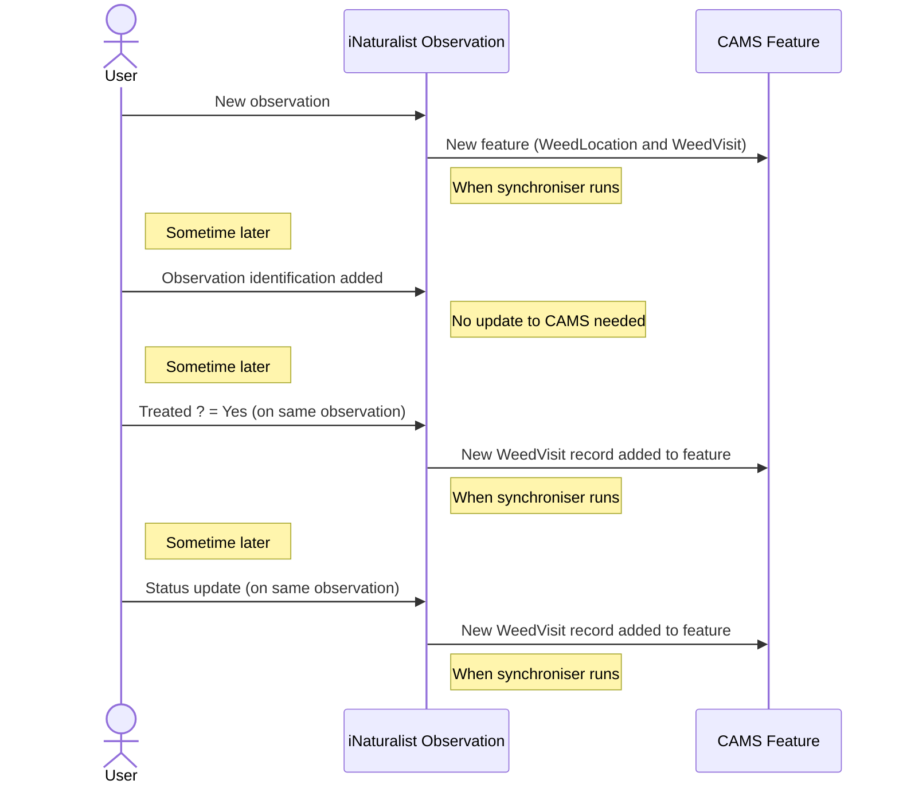

# iNaturalist to CAMS synchroniser

This repository contains a [scheduled workflow](#scheduled-workflow), [configuration](#configuration) and [code](#code) to synchronise [iNaturalist](https://www.inaturalist.org/) observations to the [CAMS Weed App](https://econet.nz/our-projects/) (running on the [ArcGIS Online](https://www.arcgis.com/home/index.html) platform). 

## Overview

The CAMS Weed App enables ongoing monitoring and control of weeds, showing different colours and shapes for the current status of the weed patch. The status is reset periodically to `Purple - please check` and the status is updated as each patch is checked:


The status of each observation can be updated by adding the observation to the [Weed Management Aotearoa NZ](https://inaturalist.nz/projects/weed-management-aotearoa-nz) iNaturalist project and setting the observation fields. See the [user guide](USER_GUIDE.md) for instructions.

The code is intended to be scheduled to run regularly, e.g. hourly, picking up new and updated observations from iNaturalist. Note that the updates to CAMS are idempotent, so can be rerun without creating new CAMS records. The synchronisation will only pick up new or updated observations containing updates that we are interested in.

We keep [this log](sync_history.md) of all observations and updates that have been synchronised.

The iNaturalist observations are selected based on taxon and place (e.g. *old man's beard* in *Wellington*). Each matching iNaturalist observation creates a new Feature in CAMS, with a parent `WeedLocation` record and a child `WeedVisit` record. Updates to the iNaturalist observation may create additional `WeedVisit` records, dependent on what caused the update, for example:



The time that the latest observation was updated is stored in a `*_time_of_last_update.txt` file. When the synchronisation is rerun, it checks for observations which have been updated since this timestamp (and then updates the file with the new last update timestamp).

## Scheduled workflow

The synchroniser is run regularly (currently hourly) by the [synchronise-inat-to-cams](.github/workflows/synchronise_inat_to_cams.yml) workflow. 

It can be triggered manually by clicking the `Run workflow` button on that page (assuming you are logged in and have permission to do so).

### Schedule

The schedule is configured in the [workflow definition](.github/workflows/synchronise_inat_to_cams.yml).
Under `on:` > `schedule:` the `cron:` setting defines a [cron expression](https://en.wikipedia.org/wiki/Cron#Cron_expression).
For example,
 
    - cron: '42 * * * *'

specifies that the workflow will be run at 42 minutes past each hour.

Note that the GitHub cron schedule uses the UTC timezone.

### Secrets

Credentials, such as the username and password for logging on, are encrypted and stored in [GitHub Secrets](../../settings/secrets/actions).

These credentials can only be read by GitHub Actions and are masked in the log files.

### Environments

#### ArcGIS
Currently all environments are within the same ArcGIS account. The code requires two ArcGIS feature layers within this account:

##### Dev/Test
An expendable feature layer for development and testing of new code. Prior to running the Behaviour Driven Development (BDD) tests, a check is made that the feature layer is intended for testing (see [environment.py](./features/environment.py)). This ensures that we are not creating and deleting test data in production.

##### Production
The main feature layer containing CAMS weed data targeted by the sychroniser.

The environment is configured in the relevant [workflow file](.github/workflows/).

#### iNaturalist
We do not have a test environment for iNaturalist, so do not perform any automated testing against iNaturalist. The operations we currently perform do not need an iNaturalist account, so are performed anonymously.

### Notifications

If the workflow fails, a notification will be sent to the person who last updated the cron schedule or, if manually triggered, the person that triggered the workflow.
See [notifications for workflow runs](https://docs.github.com/en/actions/monitoring-and-troubleshooting-workflows/notifications-for-workflow-runs) for details.

### Logs

Detailed logs can be viewed by clicking on the workflow run. See [Using workflow run logs](https://docs.github.com/en/actions/monitoring-and-troubleshooting-workflows/using-workflow-run-logs) if you need help with this.

### Timeouts

At one stage, iNaturalist had an issue reading changes which hung on the get request for 6 hours until the GitHub job timed out. To avoid this happening again we have implemented:

#### Workflow timeout
An overall timeout after 120 minutes configured in the [workflow](.github/workflows/synchronise_inat_to_cams.yml)

`    timeout-minutes: 120`

This should allow for large synchronisation jobs to be performed, while also reducing the overall minutes used when reads fail.

#### iNaturalist read timeout
An additional timeout of 120 seconds is applied to the iNaturalist read in case this hangs.

### Retries

We have sometimes had intermittent issues connecting to iNaturalist or ArcGIS. To increase the chances of success, we have added retry logic to iNaturalist and ArcGIS interface methods. These are currently set to retry 3 times with a 5 second wait between retries.

### Workflow minutes

The workflow is currently running under the GitHub free account, limited to 2,000 minutes/month. Since the workflow runs hourly, this equates to about 2.7 minutes per workflow run. 

Most of the workflow time is spent installing cached dependencies. While our immediate dependencies currently use fixed versions, some of the transitive dependencies use version ranges, which can cause this time to escalate. It's worth keeping a periodic watch on the time taken taking by the workflows to ensure they normally complete within 2 minutes.

### Time of Last Update files

The [synchronisation workflow](.github/workflows/synchronise_inat_to_cams.yml) updates several files which are subsequently committed and pushed back to GitHub. These files are:

* a `*_time_of_last_update.txt` file for each sync configuration
* `sync_history.md` containing details of all observations synchronised

## Configuration

Configuration files allow the following to be easily modified:

### Taxa and places to be synchronised

The [sync_configuration](config/sync_configuration.json) file determines which observations are synchronised from iNaturalist to CAMS.

An example definition is:

    {
        "Old Man's Beard Free Wellington": {
            "file_prefix": "ombfw",
            "taxon_ids": ["160697"],
            "place_ids": ["6868"]
        },
        "Weed Management Aotearoa NZ": {
            "file_prefix": "weed_management_aotearoa_nz",
            "project_id": "147177",
            "place_ids": ["6803"]
        }
    }

where:

* `"Old Man's Beard Free Wellington"` and `"Weed Management Aotearoa NZ"` are project names, which are only used for logging purposes
* `"file_prefix"` is used as the file prefix for the last update timestamp file. For example, the above definition causes the [ombfw_time_of_last_update.txt](ombfw_time_of_last_update.txt) to contain the time of the last record updated for this definition.
* `"taxon_ids"` contains a comma delimited list of iNaturalist taxa to be included. The [iNaturalist taxa](https://inaturalist.nz/taxa) page includes a search bar to allow you to find the relevant taxon id (after selecting the species, click on the `About` tab, scroll to the bottom and copy the 6 digit code after `iNaturalist`:).
    
  Note that the taxon id can be of a taxon higher up in the taxon lineage. For example, we use the generic [Section Elkea](https://www.inaturalist.org/taxa/879226-Elkea) to cover all Banana Passionfruit. All Banana Passionfruit, including Passiflora Tarminia, Passiflora Tripartia and hybrids, fall under this section. 
  The average volunteer won't be able to tell the difference and all of them need tackling!

  The taxon_ids must also be defined in the `taxon_mapping` file (see below).
* `"project_id"` (alternative to `"taxon_ids"`) contains an iNaturalist project ID to be included. All observations from this project will be synchronized regardless of taxon. This is useful for syncing observations from specific iNaturalist projects like "Weed Management Aotearoa NZ". The project ID can be found by navigating to the project page on iNaturalist and looking at the numeric ID in the URL.
* `"place_ids"` contains a comma delimited list of iNaturalist places to be included. The [iNaturalist places](https://www.inaturalist.org/places) page includes a search bar to allow you to find the relevant place (or you can create a new place if needed). Clicking on `Embed Place Widget` will show the place id in the URL.

Observations that either:
- contain one of the `taxon_ids` within one of the `place_ids`, or
- belong to the specified `project_id` and are within one of the `place_ids`

will be synchronised. (Note that observations must have a location and date observed set as well as geoprivacy being set to Open for the observation to be synchronised.) 

#### Updating existing entries

If you add a taxon or place to an existing entry, prior records for the new taxon or place will not automatically be synchronised. To force them to be synchronised, you must first delete the 
`file_prefix_time_of_last_update.txt` file (where `file_prefix` is replaced by the file prefix for the entry). Upon rerunning the synchronisation, all records will be resynchronised. Since the
CAMS updates are idempotent, only the new entries for taxon or place will be added and existing entries won't be modified.

**NOTE: any modifications to existing entries made through the CAMS app may be overwritten. It may be worth checking and/or backing up the data first in case of any issues.**

### Taxon mapping

The [taxon_mapping](config/taxon_mapping.json) file contains a mapping from the iNaturalist taxon to the CAMS taxon. Note that all `taxon_ids` listed in the `sync_configuration` file must have a taxon mapping entry.

For project-based synchronizations, unmapped taxa will be assigned to the "OTHER" species in CAMS, with the common name or scientific name stored in the OtherWeedDetails field.

An example definition is:

    {
        "160697": "OldMansBeard",
        "285911": "CathedralBells",
        "879226": "BananaPassionfruit"
    }

where:

* `"160697"`is the iNaturalist taxon id for Old Man's Beard
* `"OldMansBeard"` is the CAMS taxon name for Old Man's Beard. The list of taxon names can be viewed on ArcGIS by opening the feature layer, clicking on `Data` > `Fields` > `Species Menu Dropdown`
then clicking the `Edit` button next to `List of Values (Domain)`. The taxon name is the `Code` value.

### CAMS Schema

The [cams_schema](config/cams_schema.json) file contains the expected schema of the CAMS feature layer. This is used to:

1. Validate the schema at startup to ensure that the CAMS schema has not deviated from the expected schema. If the schema has deviated, the code will abort with an error message, allowing the code (or schema) to be corrected.
2. Map names of values to the coded Value.

An example definition is:

    {
        "WeedLocations": {
            "Date First Observed": {
                "name": "DateDiscovered",
                "type": "Date"
            },
            "DataSource": {
                "name": "SiteSource",
                "type": "String",
                "length": 39,
                "values": {
                    "iNaturalist": "iNaturalist_v2"
                }
            },
            ...
        }
    }

where:

* `"WeedLocations"` is the name of the layer or table (note this is either `WeedLocations` or `Weed_Visits` with the current schema)
* `"name"` is the name of the field
* `"type"` is the type of the field (with the `esriFieldType` prefix removed)
* for String fields, `"length"` contains the maximum length of the String values, allowing the String to be truncated to fit
* for fields containing coded values, the `"values"` block maps the internal names used by our code to the CAMS code (The CAMS codes can be viewed on ArcGIS by opening the feature layer, clicking on `Data` > `Fields` > _`relevant field`_
then clicking the `Edit` button next to `List of Values (Domain)`. Copy the value from the `Code` column.)

### Environment Variables

In addition to these configuration files, the following environment variables are needed to run the code locally (or must be set up in GitHub Secrets to run the GitHub Actions workflow):

* `ARCGIS_URL` must be set to the base URL of the target ArcGIS organisation (e.g. `'https://organisationname.maps.arcgis.com/'`) 
* `ARCGIS_USERNAME` must be set to the username to log on with
* `ARCGIS_PASSWORD` must be set to the password to log on with
* `ARCGIS_FEATURE_LAYER_ID` must be set to the item id of the feature layer to be updated

## Code

The code is written in Python 3.11. 

### Dependencies

The dependencies are frozen so that new transitive dependencies do not break the GitHub Actions workflows. To update the dependencies for GitHub Actions:

1. create a fresh virtualenv locally
2. `pip install -r requirements.txt`
3. `pip freeze > requirements_lock.txt`

*The `arcgis` package only supports up to Python3.11 as of 2023-09-25 (version 2.2.0 requires Python >=3.9, <3.11).*

Dependencies include:

* the awesome [pyinaturalist](https://pyinaturalist.readthedocs.io/) client for the [iNaturalist API](https://api.inaturalist.org/v1/docs/) to read the iNaturalist data.
* the [ArcGIS REST API](https://developers.arcgis.com/rest/services-reference/enterprise/get-started-with-the-services-directory.htm) to write to the CAMS weed app. 

For development, we have used the free PyCharm IDE.

### Folder structure

The folder structure is:

* `.github` contains the GitHub workflows and dependabot file (for notification of security vulnerabilities and package updates in dependencies)
* `config` contains configuration files
* `features` contains the feature files including automated test scenarios
* `inat_to_cams` contains the main code

### Overview

This diagram shows the flow of the synchronisation from iNaturalist to ArcGIS CAMS.


When the [synchroniser](inat_to_cams/synchronise_inat_to_cams.py) is invoked, it:

1. Parses the [sync_configuration](config/sync_configuration.json) file to determine the synchronisations to perform. A sync configuration contains the taxa and places to be synchronised. For each sync configuration:
    1. The `time of last update` is read
    1. A request is made to iNaturalist for any new observations for the relevant taxa and places since the previous last update time
    1. For each new observation:
        1. The observation is read by [iNaturalist_reader](inat_to_cams/inaturalist_reader.py). 
        1. This creates a complex data structure, which is flattened into an [iNaturalist_observation](inat_to_cams/inaturalist_observation.py).
        1. The [translator](inat_to_cams/translator.py) translates the observation into a [cams_feature](inat_to_cams/cams_feature.py). There is some complexity to the translation, for example:
            * some weeds are mapped at a higher level of the taxonomy than an individual species. For example, `Banana Passionfruit` is mapped to `Section Elkea` which contains a number of species and their hybrids. The translation works up the taxonomic tree until it finds a matching taxa.
            * the `visit date` and `status` are calculated dependent on the latest of the `date_controlled`, `date_of_status_update`, `date_first_observed` fields. The `status` is translated to one of the CAMS colour status fields dependent on various fields.
            * dates and times are converted from UTC to local time
        1. The `cams_feature` is written to the ArcGIS CAMS feature layer using the [cams_writer](inat_to_cams/cams_writer.py). This uses a [cams_reader](./inat_to_cams/cams_reader.py) to read the current record and check for differences before creating the `feature` and/or `visit record` if modified. Sometimes the changes in the iNaturalist observation are to fields that we aren't interested in and no changes need writing to CAMS.
            * String fields are truncated if they are longer than the target CAMS fields.
            * `cams_writer` and `cams_reader` delegate to [cams_interface](./inat_to_cams/cams_interface.py) to interface with ArcGIS. This interface also checks that the fields in the CAMS feature layer and visits table are as expected (type, length etc)
        1. A summary of any changes are [logged](./sync_history.md) using the [summary logger](./inat_to_cams/summary_logger.py). This is configured in [setup_logging](./inat_to_cams/setup_logging.py).
    1. The updated `time of last update` is written to file.


### Behaviour Driven Development

The project's features are described using [Feature Files](https://behave.readthedocs.io/en/stable/philosophy.html) that are automated using [Behave](https://behave.readthedocs.io/en/stable/index.html). Once the feature is well understood, the code to implement these features is then developed.

Explore our [feature files](features).

The resultant reports are published as artifacts at the end of each [Run Tests](../../actions/workflows/test.yml) workflow run:


Unzipping the report file and opening the `behave_reports.html` file shows the status of each scenario:


## RecordedBy and RecordedDate Implementation

The system tracks which iNaturalist user made the most relevant field update and when the observation was last modified.

### Overview

The system captures and stores:
- **RecordedByUserId**: The iNaturalist user ID (as string) of the user who updated the most relevant observation field
- **RecordedByUserName**: The iNaturalist username (as string) of the user who updated the most relevant observation field
- **RecordedDate**: The date and time when the observation was last updated

### Implementation Details

#### User Determination Logic

The system determines the user based on the following priority:
1. Compare the values of 'Date controlled' and 'Date of status update' fields
2. Use the `user_id` from whichever field has the later date value
3. If both fields are blank/empty, fall back to the observation's user ID

This logic aligns with the visit date calculation in `calculate_visit_date_and_status_and_user()`, ensuring that the recorded user corresponds to the field that determines the visit date. The `user_id` from observation field values in the pyinaturalist library represents the user who last updated that specific field.

#### Date Logic

The RecordedDate is always set to the observation's `updated_at` timestamp, or `created_at` if `updated_at` is not available.

#### Database Schema

The CAMS Visits table includes these fields:

```json
"RecordedByUserId": {
    "name": "RecordedByUserId",
    "type": "String",
    "length": 64
},
"RecordedByUserName": {
    "name": "RecordedByUserName",
    "type": "String",
    "length": 64
},
"RecordedDate": {
    "name": "RecordedDate",
    "type": "Date"
}
```

#### Data Flow

1. **INatReader** extracts user ID and date from iNaturalist observation
2. **Translator** maps the data to CAMS format
3. **CamsWriter** writes the fields to the CAMS Visits table (only when creating new visit records)
4. **CamsReader** reads the fields back when loading existing records

### Usage

#### For New Observations
The system automatically captures `RecordedBy` and `RecordedDate` information for all new observations processed through the normal synchronization flow.

#### For Existing Records (Migration)
Use the migration script to update existing records:

```bash
# Dry run to see what would be updated
python migration/update_recorded_by_fields.py --dry-run

# Update all records in batches of 25
python migration/update_recorded_by_fields.py --batch-size 25

# Update only first 100 records for testing
python migration/update_recorded_by_fields.py --limit 100

# Combination: dry run with limit
python migration/update_recorded_by_fields.py --dry-run --limit 10
```

#### Migration Script Options
- `--dry-run`: Show what would be updated without making changes
- `--batch-size N`: Process N records at a time (default: 50)
- `--limit N`: Limit to N total records (for testing)

### Example

For iNaturalist observation 8469298:
- Has a 'Date controlled' field with value "2025-10-10" and user_id 2589539 (nigel_charman)
- Has no 'Date of status update' field
- Result: 
  - RecordedByUserId = "2589539" (from Date controlled field user_id)
  - RecordedByUserName = "nigel_charman" (from Date controlled field username)
  - RecordedDate = observation's updated_at timestamp

For iNaturalist observation 319441806 (no Date controlled/Status update fields):
- Falls back to observation user: 138584 (keiths)
- Result:
  - RecordedByUserId = "138584" (observation user_id)
  - RecordedByUserName = "keiths" (observation username)

**Note**: The `user_id` in observation field values represents the user who last updated that field, which is exactly what we need for tracking field updates.

### Files Modified

#### Core Implementation
- `inat_to_cams/inaturalist_observation.py` - Added new fields to data model
- `inat_to_cams/inaturalist_reader.py` - Added field extraction logic
- `inat_to_cams/translator.py` - Added field mapping
- `inat_to_cams/cams_feature.py` - Added fields to WeedVisit class
- `inat_to_cams/cams_writer.py` - Added fields to write operations
- `inat_to_cams/cams_reader.py` - Added fields to read operations

#### New Files
- `migration/update_recorded_by_fields.py` - Migration script for existing records

#### Configuration
- `config/cams_schema.json` - Added new field definitions

### Testing

A test script is provided to verify the implementation:

```bash
python test_recorded_by_implementation.py
```

This script tests:
- User ID and username extraction from Date controlled/Status update field values
- Date comparison logic to determine which field "wins"
- Fallback to observation user when no relevant fields exist
- Both RecordedByUserId and RecordedByUserName field population
- Edge cases (empty field values, etc.)

